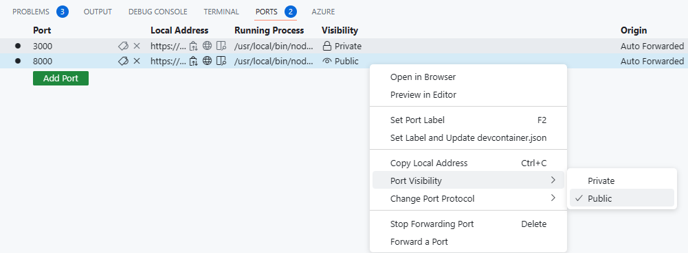
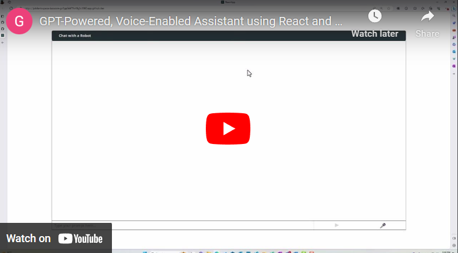

# Society of Hispanic Professional Engineers (SHPE) Demos

This sample demonstrates a simple web-based approach for creating a chatbot around the SHPE 2023 National Convention that includes text and speech based prompts. It uses Azure OpenAI Service to access the ChatGPT model (gpt-35-turbo), Azure AI Speech (part of cognitive services) to provide the speech-to-text and text-to-speech support, and Azure Cognitive Search for searching an index for data, which includes the vectors used for context. The application runs on a React front-end application written in TypeScript and a simple Express server for the back-end.

If you are interested in learning how these models work, please take a look at this article:

- [**How GPT Models Work**](https://towardsdatascience.com/how-gpt-models-work-b5f4517d5b5/?WT.mc_id=aiml-95201-gcordido)

## **Features**

* Chat interface
* Shows possible approaches for prompt construction (prompt engineering) and interaction between the model and the chosen input.
* Full version provides search capabilities using Azure Cognitive Search, as well as language capabilites through AI Speech.


## **Getting Started**

> **NOTE**: This sample requires an active Azure subscription with access to the Azure Open AI Service. Access may be requested [here](https://aka.ms/oaiapply/?WT.mc_id=aiml-95201-gcordido). You can also visit this [website](https://azure.microsoft.com/free/?WT.mc_id=aiml-95201-gcordido) to get some free Azure credits to get started.

> **AZURE RESOURCE COST**: this sample will require you to create resources that have usage costs. (expand more on this later)

### **Prerequisites**

#### Running Locally

- [Azure Developer CLI](https://aka.ms/azure-dev/install/?WT.mc_id=aiml-95201-gcordido)
- [Node.js](https://nodejs.org/en/download/?WT.mc_id=aiml-95201-gcordido)
- [Git](https://git-scm.com/downloads/?WT.mc_id=aiml-95201-gcordido)

>NOTE: Your Azure Account must have `Microsoft.Authorization/roleAssignments/write` permissions, such as [User Access Administrator](https://learn.microsoft.com/azure/role-based-access-control/built-in-roles#user-access-administrator/?WT.mc_id=aiml-95201-gcordido) or [Owner](https://learn.microsoft.com/azure/role-based-access-control/built-in-roles#owner/?WT.mc_id=aiml-95201-gcordido).
&nbsp;

#### Setting up Azure resources

Before being able to create Azure resources, we need to ensure we have logged in and authenticated into Azure. This can be done via the Azure CLI.

```console
az login
```

Once this is done, we can create a resource group that will be used to host our resources:

```console
az group create --name shpe-demo --location <eastus>
```

**Azure OpenAI Resource**

Next, we move on to create an Azure OpenAI resource. Fill in the information surrounded by `<>` to your liking.

```console
az cognitiveservices account create --name <resource-name> --resource-group shpe-demo --kind OpenAI --sku S0 --location <location>
```

**Azure AI Speech Resource**

Similarly to the Azure OpenAI resource, we can use the Azure CLI command with minor adjustments to the command.

```console
az cognitiveservices account create --name <resource-name> --resource-group shpe-demo --kind SpeechServices --sku S0--location <location>
```

**Azure Cognitive Search Resource**

Lastly, we will also use the Azure CLI to create the Azure Cognitive Search resource.

```console
az search service create --name <resource-name> --resource-group shpe-demo --kind SpeechServices --sku free <location>
```


***Accessing the resources' keys and endpoints***

This application uses the Azure OpenAI Service REST API to communicate with the model, and the SpeechSDK to run the speech recognition and speech-to-text functionalities. For both of these to work, we will need to access the resources' keys, endpoint (in the case of the OpenAI Service and the Cognitive Search service) and region (in the case of the Speech Service).

This can be done by visiting the Azure Portal or the Azure CLI. To do this via the Azure CLI, use the following command and replace the `<resource-name>` and `shpe-demo` with the ones you created in the prior steps.

```Console
az cognitiveservices account keys list --name <resource-name> --resource-group shpe-demo
```
For the endpoint:
```Console
az cognitiveservices account show --name <resource-name> --resource-group shpe-demo --query endpoint
```

And for the speech service region:
```Console
az cognitiveservices account show --name <resource-name> --resource-group shpe-demo --query location
```

### **Creating an Index with the Conference's Data**

Follow this guide to set up your searchable index: **[Preparing your Index.](./data/Preparing-your-index.md)**


### **Running in GitHub Codespaces**

GitHub Codespaces is a remote virtual development environment hosted in the cloud that you can customize with your pre-requisites using dev container configuration files. This creates a consistent and reproducible development environment for any user of your project.

Every GitHub user have access to a free Codespaces plan. To learn more about quotas and limits of your plan, check on your own GitHub account [settings](https://github.com/settings/billing). You can use GitHub Codespaces on your browser or within VSCode. To use GitHub Codespaces in VSCode, you will need to install the [GitHub Codespaces extension](https://github.com/features/codespaces/?WT.mc_id=aiml-95201-gcordido).

#### Instructions

To open this repository in GitHub Codespaces on your browser click the button below:

[](https://codespaces.new/gcordido/react-test)


Once you've started a codespace and it has finished setting up and loading, follow these steps to run the application:

1. Install dependencies by running

```Console
npm install
```
```Console
cd server npm install
```

2. Rename the `.env.example` file to `.env` and update its values with your own keys, endpoints and region. These will become environment variables for the application to access.

3. To start the server, run the following command

```Console
npm run start
```

4. To start the application, open a new terminal at the root folder and use the following command:

```Console
npm run dev
```

5s. Once the application is running, you will notice a tab named **Ports** next to the VS Code terminal. Click on it, and then make sure the Visibility for Port 3001 is changed from *Private* to *Public*.



5. Copy the *Local Address* of Port 3001, and paste it on line 46 of the [App.tsx](./client/src/App.tsx) file, where we usually would have a *localhost* URL.
Don't forget to add `/open-ai-api-call` at the end, so that it looks similar to this:

```HTTP
https://YOUR_GITHUB_CODESPACESNAME-hashedNumbers-3001.preview.app.github.dev/openai-api-call
```

6. Similarly, navigate to the [token_util.js](./client/src/token_util.js) file, and paste the *Local Address* of port 3001 on line 17, replacing the *localhost* URL.

```JavaScript
 const res = await axios.get('https://YOUR_GITHUB_CODESPACESNAME-hashedNumbers-3001.preview.app.github.dev/api/get-speech-token');
```

7. The application can be accessed by CTRL + clicking the Local Address for port 5173.

You can also find a video showcasing these steps here:


[](https://youtu.be/qPN_fHSM3ho/?WT.mc_id=aiml-95201-gcordido)

If you are a student or an educator you may request additional benefits on GitHub Codespaces. To learn more about the GitHub Codespaces for students and educators, check the [GitHub Education website](https://education.github.com?WT.mc_id=aiml-95201-gcordido).

### **Local Installation**

1. Cloning the repository

```Console
git clone 
```

2. Install dependencies by running

```Console
npm install
```
```Console
cd client npm install
```

3. Rename the `.env.example` file to `.env` and update its values with your own keys, endpoints and region. These will become environment variables for the application to access.

4. To start the server, run the following command

```Console
npm run start
```

5. To run the application, ensure you are at the root folder and use the following command:

```Console
npm run dev
```

> **Note**: You may carry out changes in the code while the application is being served and see the changes in real time. This helps for testing, but also trying some concepts such as temperature values, system prompts, token tracking and past-messages. You may read further about these topics in the following section.

## **Prompt Engineering**

Prompts play a crucial role in communicating and directing the behavior of Large Language Models (LLMs) AI. They serve as inputs or queries that users can provide to elicit specific responses from a model. 

Prompt engineering involves selecting the right wording, symbols, formats and more to guide the model in generating higher-quality texts.

### **Best practices**

Instructions play an important role in most prompts. These are some concrete tips to improve your instructions. 

- Create Concise Clarity - Provide specific instructions to the model, but don't overdo it. Imagine you are giving instructions to a human. These models are trained (for the most part) on human natural language, which means that what would be clear to a human is also likely clear to the model.

```
Give me an idea for a recipe that includes bananas and strawberries.
```

- Use a Reference Point - When possible, use a concept that the model will likey have encountered in it's training data. 

&emsp; Instead of this:
```
Write a short article about prompt engineering.
```

&emsp; Prompt this way:
```
Write a blog post about prompt engineering.
```
&emsp; &emsp; Using these well known concepts enables you to pack lots of meaning into very few tokens. 

- Order Matters - The order of your instructions can impact behavior. Later instructions are likely to be emphasized more than earlier ones. Experiment with different orders to understand the impact. 

- Provide Positive Instructions – Telling the model what “to do” rather than what “not to do” is more effective. The model’s bias is to take action, so providing it a way forward is more productive. This often means using “if”, “then” instructions. 

&emsp; For example, instead of saying:
```
You must not return offensive responses.
```

&emsp; &emsp; Try
```
If the user requests offensive content, you should apologize and say you are unable to provide that sort of content.
```

- Directly Address the Model – It has been observed that directly addressing the model with instructions of the form ```You should``` or ```You must``` result will result in better performance from the model than referring to it indirectly as “the system” or “the assistant”. 

### **System Prompts**

Besides the instructions provided by the user, we can also provide internal instructions to the model, which will improve performance. This is done through the `system` role. These provide context to the model and an initial instruction guiding its behaviour.

The system prompt can be changed in the [App.tsx](./client/src/App.tsx) file, as part of the messageList state declaration.

```typescript
  const [messageList, setMessage] = useState<{ role: string, content: string }[]>([
    { role: 'system', content: 'You are an AI chatbot that answers questions in at most two sentences.'}
  ]);
```

Try different prompts, such as:
```typescript
    { role: 'system', content: 'You are an assistant that provides information in the form of 140 character tweets.'}
```
```typescript
    { role: 'system', content: 'You are a chatbot that only responds in prose.'}
```
```typescript
    { role: 'system', content: 'You are an AI assistant. You should make the user aware of this fact.'}
```

### **Prompt Structure**

- Introduction – This section is used introduce the model to the purpose of the prompt, usually indicating the high-level domain of the task. It sometimes can include summary instructions about the prompt’s desired behavior. Introductions are typically short and more commonly used on longer prompts. Intuition: The introduction “sets the mood” of the prompt.
- Core Instructions – These are the instructions for the primary task that prompt should complete. They can be quite detailed and include items like output templates. Some instructions that are not specific to the task, capturing things like general behavior or user safety. They can often be shared between prompts. If you have many instructions, consider putting critical instructions towards the end.
- Content/Data – This is the information is being consumed or processed by the prompt. Examples could be a document to summarized, an email to be responded to, a table to be analyzed. It could include multiple items and may be structured or unstructured.
- Final Instructions – This is the final word to model before it should respond. It can act as the last summary of the task and clearly indicate the end of the prompt. 
- Examples – Examples are used to demonstrate expected inputs and outputs to the model. They are typically at the end of the prompt, finishing off with a cue.
- Section Breaks – These are elements that strongly delineate breaks between sections. They are used to signal to the model that the intent of the prompt content has shifted. The common most example of this is between instructions and content. 

### **Concepts to Keep in Mind**

#### *Tokens*

A token is a chunk of text. In the context of OpenAI GPT models, common and short words typically correspond to a single token while less common words are broken part. It is important to understand tokens as there is a limit to the number of tokens supported in the prompt and the number of tokens impact your latency and cost.
Generative models take *n* tokens in, which could be a few words, a few paragraphs, or a few pages. And they produce a single token out, which could be a short word or a part of a word.

In the case of this application, we set the maximum number of tokens as part of the parameters for the API request. This can be changed in the [server.js](./server/server.js) file.

```typescript
  const params = {
    max_tokens: 1024,
    temperature : 1,
    messages: messageList
  };
```

#### *Past-message Context*

Part of what makes LLMs interesting is their ability to use context. This is passed in the form of old messages, for which the application keeps track using the state variable `messageList`.

Initially, the model only receives the `system` prompt and the `user` prompt, but as new prompts come in, we actually provide the model with both older `user` prompts and `assistant` responses, as part of the list:

```json
[
	{
		"role": "system",
		"content": "You are an AI assistant that helps people find information."
	},
	{
		"role": "user",
		"content": "What is the capital of Washington?"
	},
	{
		"role": "assistant",
		"content": "The capital of the state of Washington is Olympia."
	}
]
```

It is important to note that hese messages will count towards our maximum number of tokens, and to avoid getting to close to the limit (where we could end up missing context) we have set up a maximum number of messages to keep track of. This number can be changed programatically, by changing the `maxMessages` constant, found in the [App.tsx](./client/src/App.tsx) file.