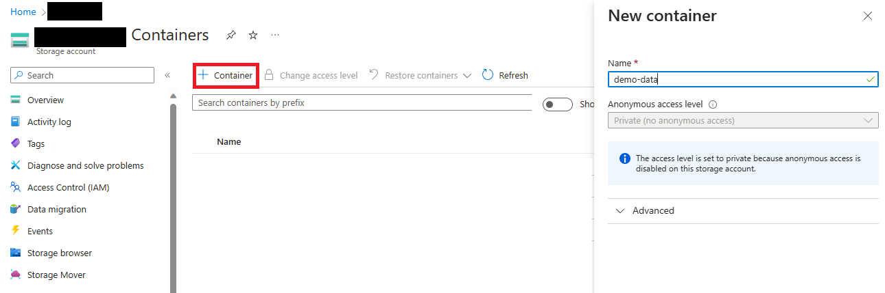
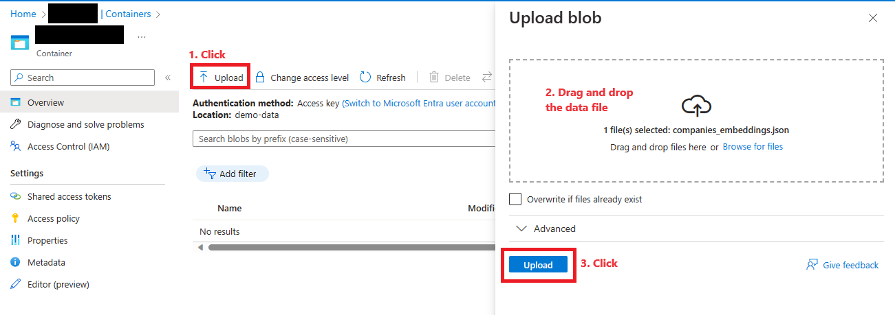
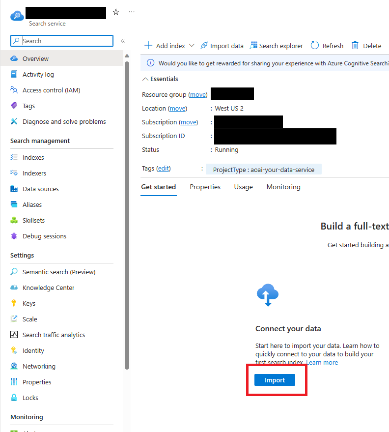
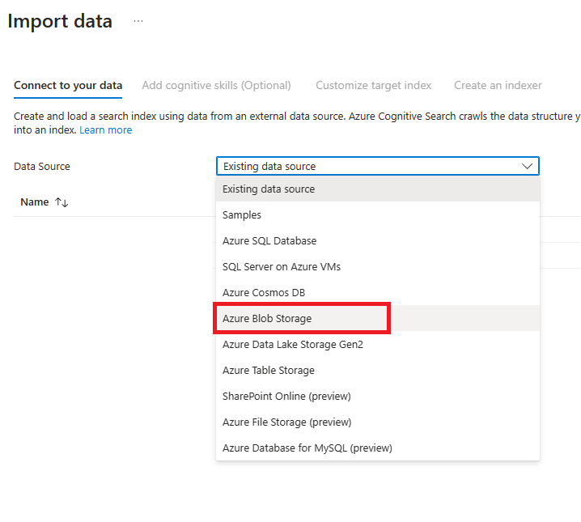
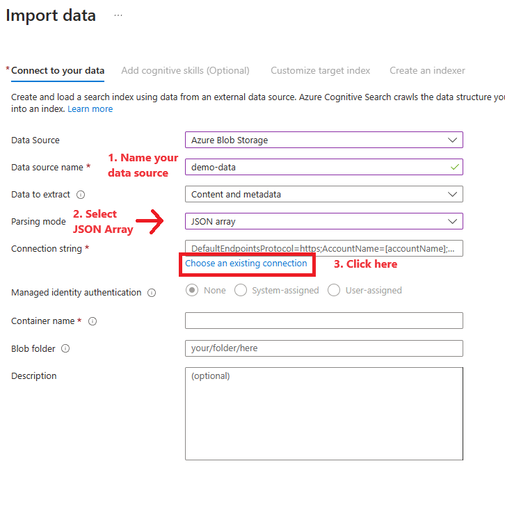
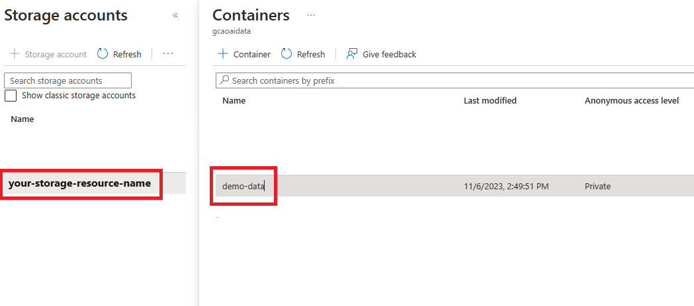
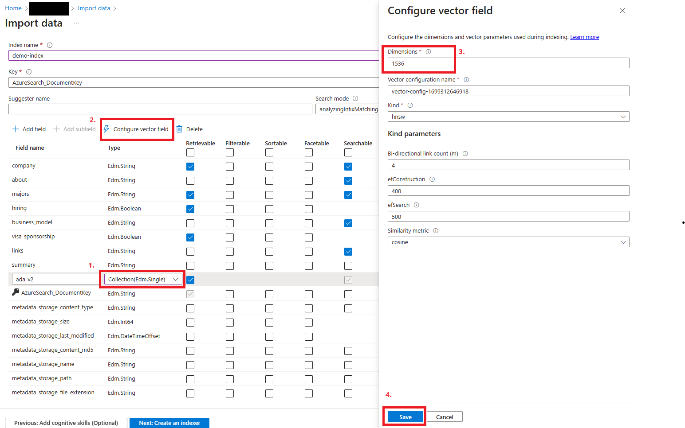
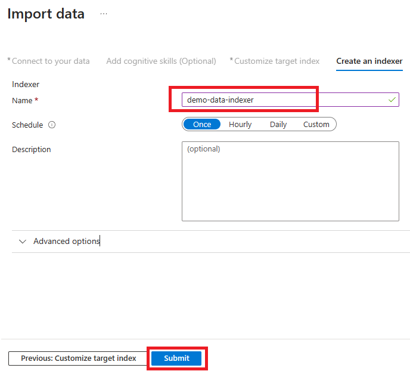

## Preparing your index

In order to run our application on data, we need to create an index where our company data will be stored. For this we will be needing an Azure Storage account, which then we will recall from our cogsearch service.

### Create Azure Storage Account and Container

1. To create an Azure Storage account, you can either use the Azure Portal or the Azure CLI. We will be using the same resource group we created for the other services.

```Console
az storage account create --name mystorageaccount --resource-group shpe-demo --location eastus --sku Standard_RAGRS --kind StorageV2
```
2. Next we will navigate to *Containers* under the Data Storage tab on the left.

3. Click on the `+ Container` button then name the container to your liking


4. Once it is created, click on the container.

#### Upload JSON data file

Now we will upload our JSON data file. You can find it in the repository under the data folder: [companies-embeddings.json](./companies_embeddings.json)

1. Click the `Upload` button.
2. Upload the file by dragging and dropping it in the blob tab.
3. Click Upload.



Once your data is finished uploading we can move forward. Go back to your Azure Cognitive Search resource.

### Importing your data to Cognitive Search Service

At the Search Service resource (if you have not created it yet, isntructions to create it are found in the repository's [README](../README.md)), click on the `Import` button under the overview tab.



This will bring you to the process of creating an index as well as an indexer for your data.

#### Selecting Source

1. The first step is selecting our data source. We will be connecting to the data we uploaded to the blob storage before, so select the `Azure Blob Storage` option.


2. Next, we will name our resource, select JSON array for our parsing mode and click on existing connection to find our data source.


3. This will bring you to a window where you can select the storage account you created previously, and select the container with your JSON data file. Click on it.


4. Once the data is selected, we will click on the `Next` button, skipping the `Add cognitive skills (Optional)` tab, until we are at `Customize target index`.

### Configuring Index

You will notice at this tab that we have our data fields are already set in place. 

1. Ensure to name your index, as this is the name you will be using in the [.env](../chat-app/server/.env.example) file.

2. Next, select the `Retrievable` and `Searchable` checks on the fields as shown below, and ensure that the `Type` of the `ada_v2` field is `Collection(Edm.Single)`. This will allow us to create a vector configuration for the index. 

3. Click on `Configure vector field` button, and write down `1536` in the Dimensions field. These are the dimensions of the embeddings in our data set. Click Save.


4. Click on `Next: Create an Indexer`

### Create Indexer

As the final step, we will name our indexer to our liking and click on `Submit`. 



The Indexer will then take sometime to build, but it should return a success. Azure will provide your with a link to monitor its progress, or you can check the progress yourself by clicking on the `Indexers` tab on the left.

Once it is done running, your index is ready to use for search!

**[Click here to go back to the general instructions.](../README.md)**